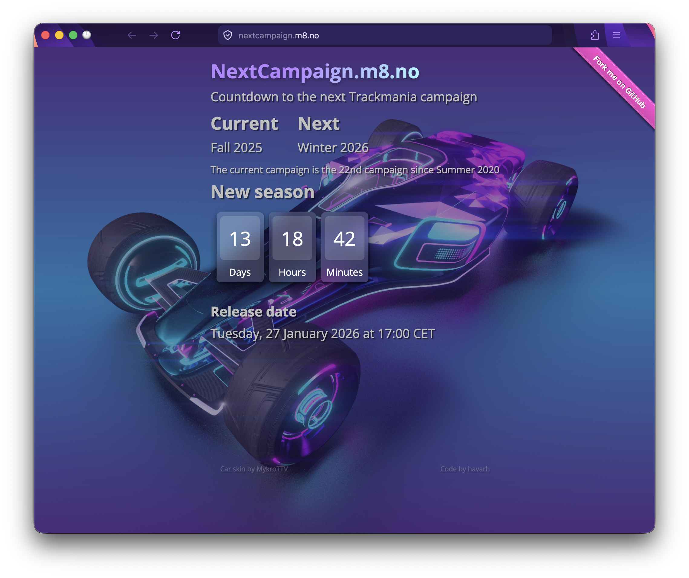
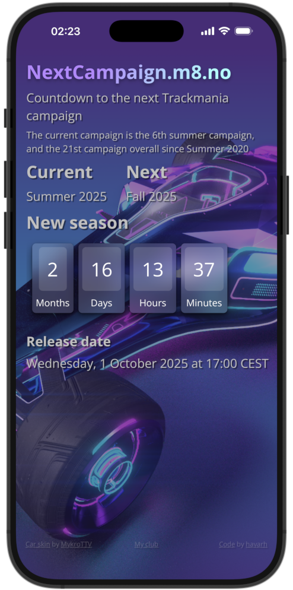

# NextCampaign - Next Trackmania Campaign Countdown

A small web app that displays a **live countdown to when the next official Trackmania seasonal campaign is released**, along with information about the current campaign.  
The countdown updates in real time and switches seamlessly when a new campaign begins.

## Live Demo

[**CodePen demo**](https://codepen.io/havarh/pen/eYMmLYj/5f09685df5c0d673ce23292bf90f8289)

**Live site**

[nextcampaign.m8.no](https://nextcampaign.m8.no/)

## Screenshots
### NextCampaign on Firefox



### NextCampaign as a PWA app on iPhone


## Features
- Live countdown to the next official Trackmania seasonal campaign release
- Displays information about the current and upcoming campaign
- Accurate timing based on cached data from the official Trackmania Live Services API
- Automatic updates via a server-side PHP CLI script
- Fully static frontend (no client-side API calls)

- Progressive Web App (PWA) support:
  - Installable on desktop and mobile
  - Standalone app-style display
  
## How it works

### Campaign data and API usage

Campaign timing data is fetched from the official Trackmania Live Services API.  
A **PHP CLI script** authenticates against the API, retrieves the current and upcoming campaign metadata, and writes a cached JSON file that the frontend reads.

This approach keeps the frontend completely static while still ensuring accurate and up-to-date campaign timing.

Key points:
- The API is queried server-side only
- The result is stored as a simple JSON file
- The frontend never talks directly to the Trackmania API

### PHP CLI script and cron

The PHP script is intended to be run from the command line and not necessarily exposed via the web server.

Typical usage is via `cron` on \*nix systems:

```bash
0 * * * * /usr/bin/php /path/to/project/tools/fetch_campaign.php
```
The script can safely be run frequently (e.g. hourly)
- Internal freshness checks prevent unnecessary API calls, the API is only called every 48 hours or when a new campaign is released.
- Only the generated JSON file is served to the browser
### Frontend logic
- JavaScript reads the cached JSON file
- Date and time calculations are handled using Luxon
- A live countdown is rendered and updated continuously
- When the countdown reaches zero, a small celebration animation is triggered

## Contributing

Pull requests are welcome. For major changes, please open an issue first.

## Acknowledgements

- [**Luxon**](https://github.com/catdad/canvas-confetti) for robust date and time handling
- [**canvas-confetti**](https://github.com/moment/luxon/) for the confetti animation when the countdown finishes


## Roadmap

- Maybe replace Luxon with Temporal when it becomes [Baseline Widely available](https://developer.mozilla.org/en-US/docs/Web/JavaScript/Reference/Global_Objects/Temporal)

